# GAASD 自动驾驶安全控制演示工程

本工程包含两个核心算法模块：**`waypointFollow`**（端到端路点跟踪 MPC 控制器）与 **`cbf`**（基于控制障碍函数的安全控制修正层），用于演示“感知-规划-控制-安全仲裁”闭环中的关键算法环节。

---

## 一、工程总体架构

### 1.1 模块定位

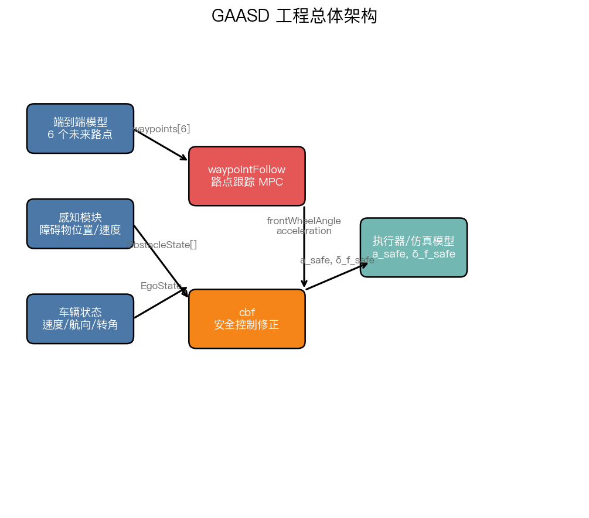

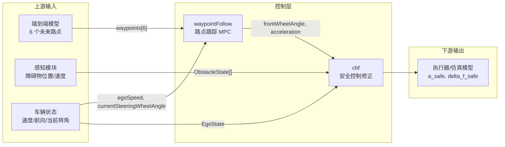

### 1.2 数据流说明

1. **waypointFollow** 接收自车速度、当前方向盘转角和未来 3 秒的 6 个路点，输出目标方向盘转角、目标前轮转角和目标纵向加速度。
2. **cbf** 接收自车状态、原始控制（前轮转角 + 加速度）和 ego frame 下的障碍物状态，求解 HOCBF-QP 后输出安全加速度 `aSafe` 和安全前轮转角 `deltaFSafe`。
3. 上层系统或仿真器将 `aSafe` / `deltaFSafe` 下发给车辆执行器。

### 1.3 目录结构

```
gaasdDemo/
├── cbf/                          # CBF 安全控制修正模块
│   ├── include/cpp/              # C++ 头文件
│   ├── src/cpp/                  # C++ 实现
│   ├── include/mbd/              # MBD FuncModule 头文件
│   ├── src/mbd/                  # MBD 实现
│   ├── models/                   # MBD JSON 拓扑蓝图
│   ├── tests/                    # 单元/集成/MBD 测试
│   ├── scripts/                  # 辅助脚本
│   ├── doc/                      # LaTeX 设计文档
│   ├── CMakeLists.txt
│   └── Readme.md                 # CBF 模块详细文档
│
├── waypointFollow/               # 端到端路点跟踪 MPC 控制器
│   ├── include/cpp/              # C++ 头文件
│   ├── src/cpp/                  # C++ 实现
│   ├── include/mbd/              # MBD FuncModule 头文件
│   ├── src/mbd/                  # MBD 实现
│   ├── models/                   # MBD JSON 拓扑蓝图
│   ├── tests/                    # 单元/MBD 测试
│   ├── CMakeLists.txt
│   └── Readme.md                 # waypointFollow 模块详细文档
│
├── test/                         # 跨模块集成测试
│   └── integration_sim/          # waypointFollow + cbf 联合闭环仿真
│       ├── src/integration_sim.cpp
│       ├── scripts/plot_scenarios.py
│       ├── output/               # CSV + PNG 仿真结果
│       ├── CMakeLists.txt
│       └── README.md
│
└── README.md                     # 本文档
```

---

## 二、模块内部逻辑

### 2.1 waypointFollow 模块逻辑

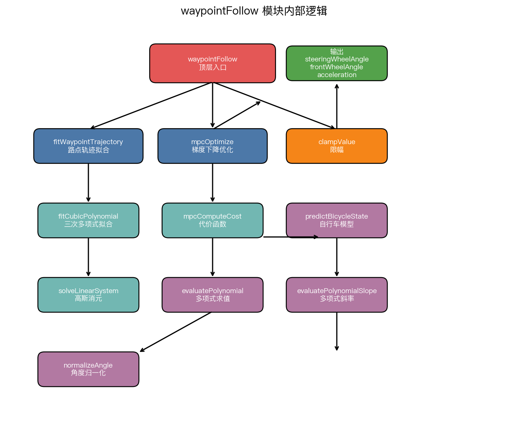

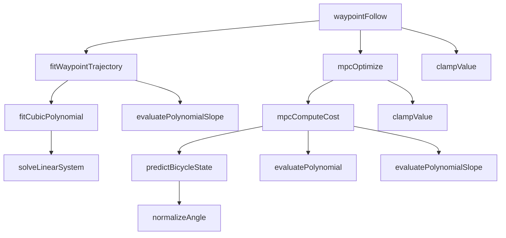

**流程说明：**

1. `fitWaypointTrajectory` 将 6 个路点拟合为三次多项式参考轨迹。
2. `mpcOptimize` 使用数值梯度下降优化未来 5 步的控制序列。
3. `mpcComputeCost` 计算 MPC 代价，内部调用 `predictBicycleState` 前向预测。
4. 提取第一步控制量，经 `clampValue` 限幅后输出。

### 2.2 cbf 模块逻辑

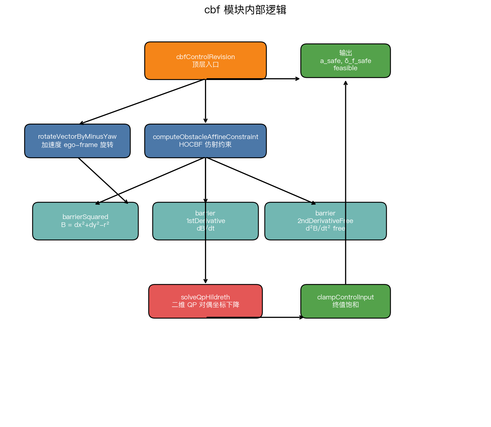

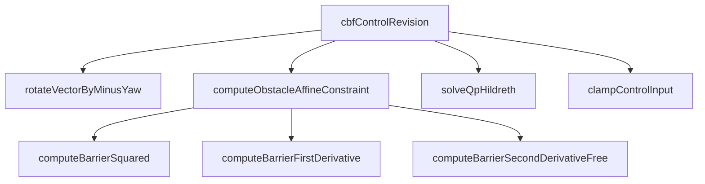

**流程说明：**

1. 将障碍物全局加速度旋转到 ego frame。
2. 对每个障碍物生成二阶 HOCBF 仿射约束。
3. 叠加控制输入 box 约束，装配为 2D QP。
4. 使用 Hildreth 对偶坐标下降求解 QP。
5. 对解做终值饱和，输出安全控制。

---

## 三、关键接口

### 3.1 waypointFollow 接口

**输入：** `WaypointFollowInput`

| 字段 | 类型 | 说明 |
|---|---|---|
| `egoSpeed` | double | 自车车速 (m/s) |
| `currentSteeringWheelAngle` | double | 当前方向盘转角 (rad) |
| `waypoints[6]` | Waypoint | 未来 0.5/1.0/1.5/2.0/2.5/3.0 s 的参考路点 |

**输出：** `WaypointFollowOutput`

| 字段 | 类型 | 说明 |
|---|---|---|
| `steeringWheelAngle` | double | 目标方向盘转角 (rad) |
| `frontWheelAngle` | double | 目标前轮转角 (rad) |
| `acceleration` | double | 目标纵向加速度 (m/s²) |

**坐标系：** 自车坐标系，x 向前为正，y 向左为正。

### 3.2 cbf 接口

**输入：** `EgoState` + `ObstacleState[]` + `CbfParam`

| 结构体 | 字段 | 说明 |
|---|---|---|
| `EgoState` | `velocity`, `phi`, `aOriginal`, `deltaFOriginal` | 自车速度、航向、原始控制 |
| `ObstacleState` | `dxEgo`, `dyEgo`, `vRxEgo`, `vRyEgo`, `axGlobal`, `ayGlobal` | 障碍物 ego frame 相对状态 + 全局加速度 |
| `CbfParam` | `safetyRadius`, `alpha1`, `alpha2`, `wheelBase`, `aMin`, `aMax`, `deltaFMin`, `deltaFMax`, `qDiagAccel`, `qDiagSteer` | CBF 算法参数 |

**输出：** `CbfOutput`

| 字段 | 类型 | 说明 |
|---|---|---|
| `aSafe` | double | 修正后安全加速度 (m/s²) |
| `deltaFSafe` | double | 修正后安全前轮转角 (rad) |
| `feasible` | bool | QP 是否找到可行解 |
| `activeNum` | size_t | 生效的 CBF 约束数 |
| `iterUsed` | size_t | QP 实际迭代步数 |

### 3.3 集成仿真数据流

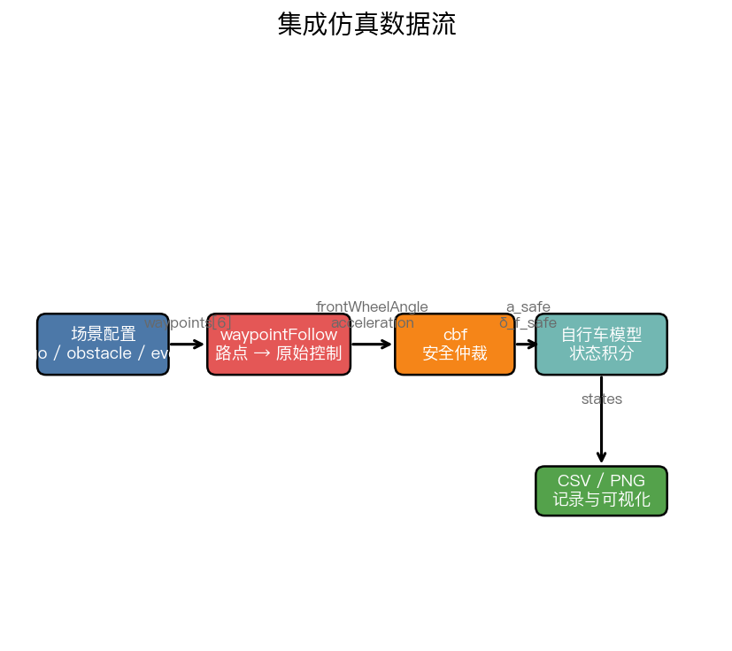

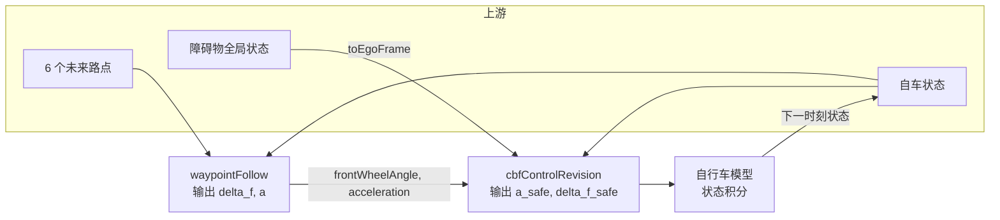

**流程说明：**

1. 仿真器按场景生成 6 个未来路点与自车初始状态。
2. `waypointFollow` 输出目标前轮转角 `frontWheelAngle` 与纵向加速度 `acceleration`。
3. `cbf` 将障碍物全局状态通过 `toEgoFrame` 转换到 ego frame，求解 HOCBF-QP。
4. 安全控制量输入自行车模型进行状态积分，得到下一时刻 ego 状态并闭环迭代。

---

## 四、集成测试场景

`test/integration_sim/` 提供了 4 个联合闭环仿真场景：

| 场景 | 主要验证点 | 策略 |
|---|---|---|
| `lead_brake` | 前车急刹 | 纵向制动 |
| `cut_in` | 右侧车辆切入 | 减速 + 轻微转向 |
| `cross_pedestrian` | 行人横穿 | 减速为主 |
| `swerve_obstacle` | 车道内静止障碍物 | 转向规避 |

### 4.1 集成仿真运行

```bash
cd test/integration_sim
cmake -B build
cmake --build build
./build/integration_sim
python3 scripts/plot_scenarios.py
```

产物位于 `test/integration_sim/output/`。

### 4.2 仿真结果

| 场景 | 策略 | 最小距离 | 最终速度 |
|---|---|---|---|
| `lead_brake` | 纯纵向制动 | 7.40 m | 4.06 m/s |
| `cut_in` | 减速 + 轻微转向 | 5.55 m | 11.81 m/s |
| `cross_pedestrian` | 减速为主 | 5.17 m | 0.45 m/s |
| `swerve_obstacle` | 转向为主 | 16.35 m | 14.60 m/s |

> 最小距离均大于 CBF 安全半径 5 m，说明安全修正有效。

**典型场景轨迹：**

| 前车急刹 `lead_brake` | 切入 `cut_in` |
|---|---|
| 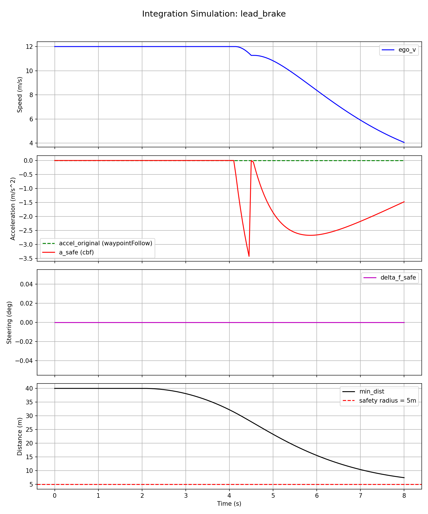 | 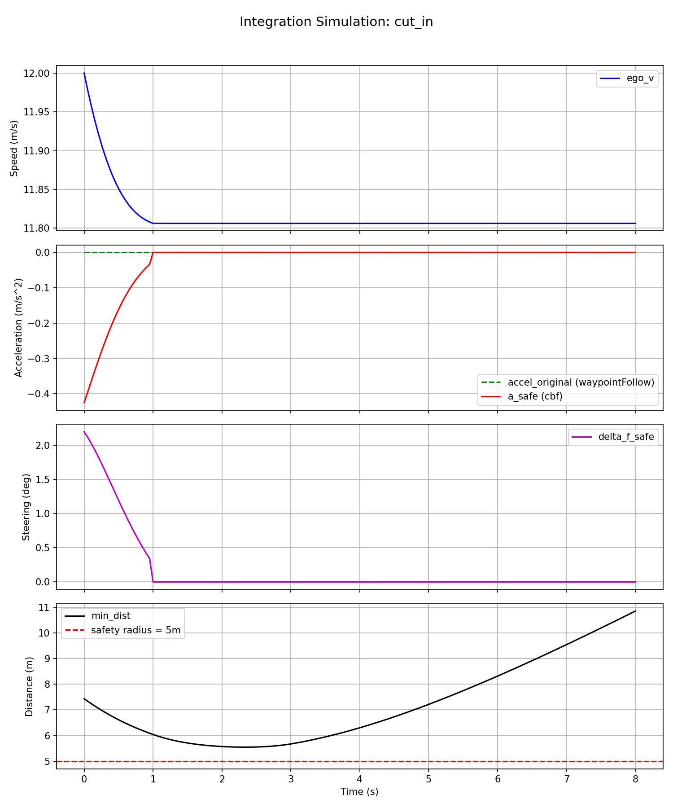 |

| 行人横穿 `cross_pedestrian` | 转向规避 `swerve_obstacle` |
|---|---|
| 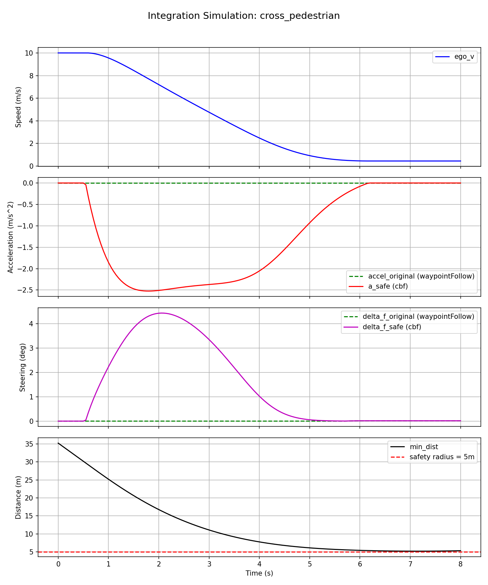 | 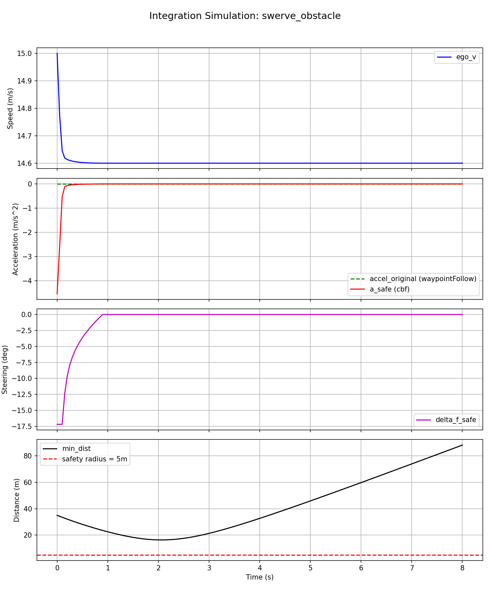 |

---

## 五、独立构建与测试

### 5.1 waypointFollow

```bash
cd waypointFollow
cmake -B build
cmake --build build
ctest --test-dir build --output-on-failure
```

### 5.2 cbf

```bash
cd cbf
cmake -B build
cmake --build build
ctest --test-dir build --output-on-failure
```

---

## 六、设计约定

- **One Function Per File**：每个 `.cpp` 仅实现一个核心函数。
- **SSA 静态单赋值风格**：优先使用 `const` 局部变量。
- **单一出口**：每个函数只有一个 `return`。
- **无动态分配**：核心算法使用固定容量栈数组。
- **双架构**：每个模块同时维护面向过程的 `cpp` 实现和模型驱动的 `mbd` 实现。

---

## 七、参考

- CBF 模块：`cbf/Readme.md`
- waypointFollow 模块：`waypointFollow/Readme.md`
- 集成仿真：`test/integration_sim/README.md`
