# CBF 自动驾驶安全控制修正模块（障碍物-only 场景）

## 一、项目简介

本工程基于论文 *"A Control Barrier Function-Based Driving Safety Control Revision Method for Autonomous Vehicles Plus Applicability Analysis"* (IEEE TIE 260121) 的 Section II（Preliminaries）与 Section III-A（Constraints for Traffic Participants），实现了一个 **C++ CBF 安全控制修正模块**：

- **输入**：自车速度、朝向、原始控制指令（加速度 a、前轮转角 δ_f）；周围障碍物的 ego frame 相对位置 / 相对速度 / 全局加速度。
- **输出**：经 CBF 修正后的安全加速度 a* 与安全前轮转角 δ_f*。
- **场景设定**：仅考虑障碍物（前车、切入车、横穿行人），不考虑车道线约束。

工程严格遵循 `prompt/00_gaasdPrompt.md` 的规范：**SSA 静态单赋值风格、One Function Per File、单一出口、struct 承载数据、函数承载算法、固定容量缓存（无动态分配）、中文 Doxygen 注释**。

### 作者与 AI 使用说明

- **作者**：CBF Module Team
- **是否使用 AI**：是
- **AI 模型**：Claude（Anthropic Claude-Opus-4.7）

---

## 二、目录结构

```
cbfArbitration/
├── ref/                              # 参考论文（TIE 260121.pdf）
├── prompt/                           # 规范入口（00_gaasdPrompt.md 等）
├── include/cpp/                      # 头文件（扁平化，单文件）
│   ├── cbfTypes.hpp                  # 通用类型 / 参数 / 输入输出结构体
│   ├── rotateVectorByMinusYaw.hpp
│   ├── computeBarrierSquared.hpp
│   ├── computeBarrierFirstDerivative.hpp
│   ├── computeBarrierSecondDerivativeFree.hpp
│   ├── computeObstacleAffineConstraint.hpp
│   ├── clampControlInput.hpp
│   ├── solveQpHildreth.hpp
│   └── cbfControlRevision.hpp
├── src/cpp/                          # 实现文件（扁平化，单文件）
│   └── ...                           # 8 个 .cpp，与 include/cpp 一一对应
├── tests/cppTest/
│   ├── unit/<FunctionName>/          # 各函数单元测试 + JSON 用例（按模块名建子目录）
│   │   ├── <FunctionName>_test.cpp
│   │   ├── <FunctionName>_cases.json
│   │   └── output/                   # 单元函数行为可视化（plot_<name>.py + *_response.png）
│   ├── sim/simulate_scenarios.cpp    # 闭环仿真主程序
│   ├── Integration/<scenario>/       # 集成测试（仿真 CSV + 绘图 PNG，按场景建子目录）
│   └── verify/                       # 各函数代码规范验证报告
├── doc/<FunctionName>/               # LaTeX 设计文档（按模块名建子目录）
├── include/mbd/                      # MBD FuncModule 头文件（扁平化）
├── src/mbd/                          # MBD 模块实现（扁平化）
├── models/                           # MBD JSON 拓扑蓝图
├── tests/mbdTest/
│   ├── unit/<Module>/                # MBD 单元测试 + JSON 用例
│   │   ├── <Module>_test.cpp
│   │   ├── <Module>_cases.json
│   │   └── output/                   # 单模块行为可视化（plot_<Module>.py + *_response.png）
│   ├── verify/                       # MBD 架构验证报告
│   └── Integration/                  # MBD 集成测试产物（预留）
├── scripts/                          # Python 辅助脚本
├── CMakeLists.txt
└── Readme.md
```

> **目录约定**：除 `src/`、`include/` 下的源/头文件采用扁平化布局外，其他分类目录（`tests/.../unit`、`doc/`、`tests/.../Integration` 等）下的每个函数/模块/场景必须建立以其名字命名的子目录。
> **测试层级**：`tests/.../unit/<name>/output/` 存放该函数/模块的单元行为可视化产物；`tests/.../Integration/` 存放跨模块的集成测试 / 闭环仿真产物。

---

## 三、CBF 算法原理与公式映射

### 3.1 控制 affine 自车模型（论文式 (5)–(6)）

$$
\dot x_1 = f_1(x_1) + g_1(x_1)\,u,\quad
x_1=[x_g,\,y_g,\,v,\,\varphi]^\top,\quad
u=[a,\;\tan\delta_f]^\top
$$

$$
f_1=\begin{bmatrix}v\cos\varphi\\ v\sin\varphi\\ 0\\ 0\end{bmatrix},\quad
g_1=\begin{bmatrix}0&0\\0&0\\1&0\\0&v/L\end{bmatrix}
$$

### 3.2 平方型 Barrier 函数（论文式 (10) 简化形式）

$$
B(x_1)=(x_{ob}-x_g)^2+(y_{ob}-y_g)^2-c_{safe}^2
$$

> 工程实现使用 ego frame 下的相对位置 `dx, dy`，因此  
> `B = dx*dx + dy*dy - r_safe^2`。

### 3.3 HOCBF 一阶 / 二阶导数

$$
\dot B = 2(dx\cdot v_{rx}+dy\cdot v_{ry})
$$

$$
\ddot B \;|_{\text{free}}=2(v_{rx}^2+v_{ry}^2)+2(dx\cdot a^{ego}_{x,rel}+dy\cdot a^{ego}_{y,rel})
$$

控制相关项整理为线性形式：

$$
\ddot B = \ddot B|_{\text{free}} \;+\; (-2\,dx)\cdot a \;+\; \left(-\frac{2v^2}{L}dy\right)\cdot \tan\delta_f
$$

### 3.4 HOCBF 仿射约束（论文式 (11)–(12)）

$$
m_1(u)=\ddot B+(\alpha_1+\alpha_2)\dot B+\alpha_1\alpha_2 B \;\geq\; 0
$$

整理为标准仿射形式：

$$
\boxed{\;\beta_a\cdot a + \beta_t\cdot \tan\delta_f \;\geq\; \text{bound}\;}
$$

其中：
- $\beta_a = -2\,dx$
- $\beta_t = -\dfrac{2v^2}{L}\,dy$
- $\text{bound} = -\bigl(\ddot B|_{\text{free}}+(\alpha_1+\alpha_2)\dot B+\alpha_1\alpha_2 B\bigr)$

### 3.5 CBF-QP（论文式 (14)）

$$
u^*=\arg\min_{u}\;(u-u_o)^\top Q(u-u_o)\quad
\text{s.t.}\;m_{1,i}(u)\geq 0,\;\forall i;\;\;u\in\mathcal U
$$

工程使用 **Hildreth 对偶坐标下降** 求解二维 QP，固定容量、无动态分配，最大约束数为 `MAX_OBSTACLE_NUM(32)+4 (box)`。

---

## 四、函数层级关系树与公式映射

```
cbfControlRevision()                 ── 顶层入口（公式 (14) QP 装配 + 求解）
├── rotateVectorByMinusYaw()         ── 全局加速度 → ego frame
├── computeObstacleAffineConstraint()── 单障碍 HOCBF 仿射约束（公式 (11)）
│   ├── computeBarrierSquared()      ── B = dx² + dy² − r²
│   ├── computeBarrierFirstDerivative() ── Ḃ
│   └── computeBarrierSecondDerivativeFree() ── B̈ 的 u 无关项
├── solveQpHildreth()                ── 二维 QP 对偶坐标下降
└── clampControlInput()              ── (a*, δ*) 终值饱和
```

| 函数名 | 对应公式 / 物理意义 |
|---|---|
| `rotateVectorByMinusYaw` | 二维向量左乘 R(−φ) |
| `computeBarrierSquared` | $B=dx^2+dy^2-r_{safe}^2$ |
| `computeBarrierFirstDerivative` | $\dot B=2(dx\,v_{rx}+dy\,v_{ry})$ |
| `computeBarrierSecondDerivativeFree` | $\ddot B$ 的 u 无关项 |
| `computeObstacleAffineConstraint` | $\beta_a a+\beta_t \tan\delta_f \geq \text{bound}$ |
| `solveQpHildreth` | $\min \tfrac12 u^\top Q u + c^\top u\ \text{s.t. } Au\le b$ |
| `clampControlInput` | $a\in[a_{min},a_{max}],\;\delta_f\in[\delta_{min},\delta_{max}]$ |
| `cbfControlRevision` | 模块顶层，等同论文式 (14) 的工程实现 |

---

## 五、函数调用拓扑与数据流图（Mermaid）

### 5.1 调用拓扑

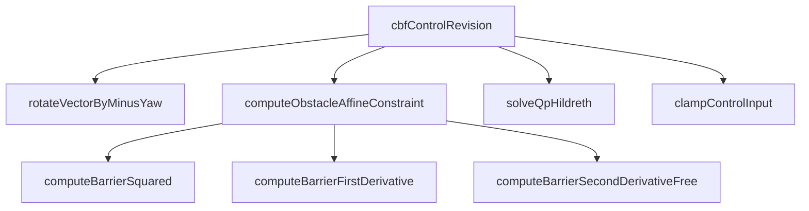

### 5.2 数据流

```mermaid
flowchart LR
    EGO[EgoState\nv, phi, a_o, delta_o] --> CR[cbfControlRevision]
    OBS[ObstacleState[]\ndx, dy, vRx, vRy, ax, ay] --> CR
    PAR[CbfParam\nalpha1, alpha2, r_safe, L, ...] --> CR

    CR -->|"R(-phi)"| ROT[ego-frame ax, ay]
    ROT --> AC[Affine Constraints]
    OBS --> AC
    AC -->|"A, b"| QP[Hildreth QP Solver]
    EGO -->|"Q, c"| QP
    QP -->|"a, tan-delta"| CL[clampControlInput]
    CL --> OUT[CbfOutput\na_safe, delta_safe, feasible]
```

---

## 六、构建与运行

### 6.1 依赖

- C++17 编译器（已在 macOS / Apple Clang 测试）
- CMake ≥ 3.16
- Python 3 + matplotlib（仅用于绘图，绑定 `~/.ai-env/bin/python3`）

### 6.2 构建

```bash
cd cbf
cmake -S . -B build -DCMAKE_BUILD_TYPE=Debug
cmake --build build -j
```

### 6.3 运行单元测试（CTest）

```bash
cd build && ctest --output-on-failure
```

预期输出：8 个单元测试全部通过：

```
Test #1: test_rotateVectorByMinusYaw                ... Passed
Test #2: test_computeBarrierSquared                 ... Passed
Test #3: test_computeBarrierFirstDerivative         ... Passed
Test #4: test_computeBarrierSecondDerivativeFree    ... Passed
Test #5: test_computeObstacleAffineConstraint       ... Passed
Test #6: test_clampControlInput                     ... Passed
Test #7: test_solveQpHildreth                       ... Passed
Test #8: test_cbfControlRevision                    ... Passed
```

### 6.4 运行闭环仿真 + 绘图（集成测试）

```bash
./build/simulate_scenarios
~/.ai-env/bin/python3 scripts/plot_scenarios.py
```

仿真完成后将依次产出 `tests/cppTest/Integration/<scenario>/<scenario>.csv` 与 `<scenario>_plot.png`。

### 6.5 生成单元响应图（每个函数单独）

```bash
~/.ai-env/bin/python3 scripts/gen_cpp_unit_plots.py
for n in rotateVectorByMinusYaw computeBarrierSquared computeBarrierFirstDerivative \
         computeBarrierSecondDerivativeFree computeObstacleAffineConstraint \
         clampControlInput solveQpHildreth cbfControlRevision; do
  ~/.ai-env/bin/python3 tests/cppTest/unit/$n/output/plot_$n.py
done
```

PNG 输出到 `tests/cppTest/unit/<FunctionName>/output/<FunctionName>_response.png`。

### 6.6 生成代码规范验证报告

```bash
~/.ai-env/bin/python3 scripts/gen_verify_reports.py
```

报告输出至 `tests/cppTest/verify/<FunctionName>_verify.txt`，对每个核心函数检查：禁用 `class`、One Function Per File、`#pragma once`、中文注释、小驼峰命名、SSA-const 风格、单一出口、Doxygen 头部信息等。

---

## 七、仿真场景与验证结果

### 7.1 场景一：前车急刹（lead_brake）

- 自车初始 v=12 m/s 直行；前车在 x=35 m 处，t∈[2, 4.5]s 以 -3.5 m/s² 急刹。
- CBF 修正后自车顺利减速跟停；最近距离 **5.78 m**（≥ r_safe=5.0 m），末态 v ≈ 2.0 m/s。

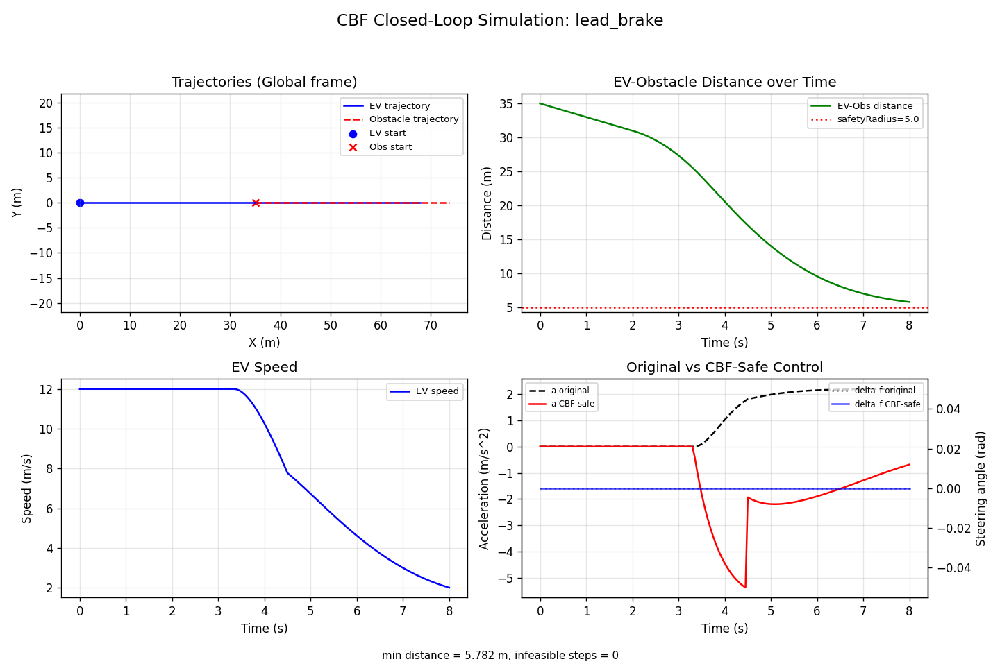

### 7.2 场景二：右后方车切入（cut_in）

- 一辆背景车从右后方 (6, -3.5) 起加速并向左变道切入自车前方。
- 自车未触发硬刹，但 a_safe 较 a_orig 显著降低；最近距离 **6.39 m**。

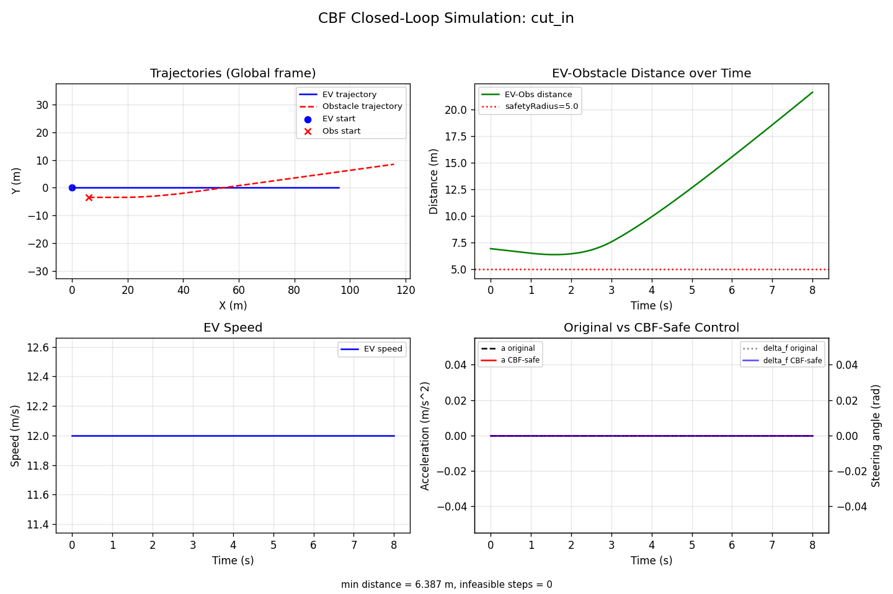

### 7.3 场景三：行人横穿（cross_pedestrian）

- 行人从右侧 (30, -8) 以 vy = 1.5 m/s 横穿。
- 由于碰撞窗口与自车错开，CBF 仅做微调；最近距离 **13.01 m**。

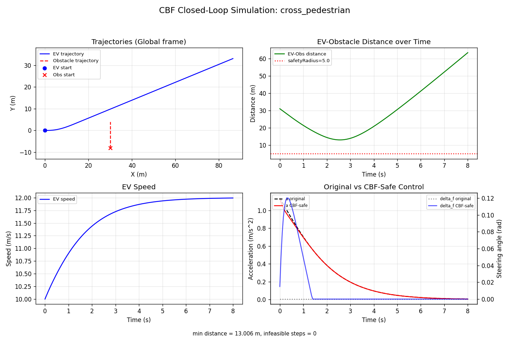

每个场景生成的 4 联图依次为：**XY 轨迹 / 自车-障碍物距离 / 自车速度 / 原始 vs 安全控制指令对比**。

---

## 八、关键工程约定

1. **不使用业务 class**：所有数据由 `struct` 承载，所有算法由独立函数承载。
2. **One Function Per File**：每个 `.cpp` 仅包含一个对外函数实现；同名 `.hpp` 头文件位于镜像路径下。
3. **SSA 风格**：函数体内尽可能使用 `const` 局部变量；非常量仅用于循环变量、累加器、缓冲。
4. **单一出口**：所有函数仅在末尾 `return` 一次。
5. **固定容量**：`MAX_OBSTACLE_NUM = 32`，QP 矩阵 / 约束数组皆为栈上数组，零动态分配。
6. **第三方库限制**：核心算法仅依赖 C++ 标准库（`<cmath>` / `<algorithm>` 等），无外部数学库。
7. **中文 Doxygen 注释**：所有 `.hpp` 都附带文件 / 函数级中文 Doxygen，便于生成设计文档。

---

## 九、Step 03 — 函数级 LaTeX 设计文档

依据 `prompt/CppDesign/03_design_doc_gen.md`，为 8 个核心函数批量生成中文 LaTeX 设计文档。脚本统一处理特殊字符转义（`_`、`^`、`~`、`&`、`%`、`#`）以及 Greek 字符到 math-mode 的映射（α/β/δ/λ 等），使用 `xeCJK` 渲染中文，TikZ 绘制函数调用流程与父子层级图。

### 9.1 生成与编译

```bash
~/.ai-env/bin/python3 scripts/gen_design_docs.py     # 8 份 .tex
~/.ai-env/bin/python3 scripts/compile_all_docs.py    # xelatex 双轮 → 8 份 .pdf
```

### 9.2 产物清单

```
doc/
├── rotateVectorByMinusYaw/rotateVectorByMinusYaw.{tex,pdf}
├── computeBarrierSquared/computeBarrierSquared.{tex,pdf}
├── computeBarrierFirstDerivative/computeBarrierFirstDerivative.{tex,pdf}
├── computeBarrierSecondDerivativeFree/computeBarrierSecondDerivativeFree.{tex,pdf}
├── computeObstacleAffineConstraint/computeObstacleAffineConstraint.{tex,pdf}
├── clampControlInput/clampControlInput.{tex,pdf}
├── solveQpHildreth/solveQpHildreth.{tex,pdf}
└── cbfControlRevision/cbfControlRevision.{tex,pdf}
```

每份 PDF 包含：函数职责、I/O 表格（longtable）、数学公式、计算步骤、子函数调用关系、TikZ 流程图与边界条件说明。

---

## 十、Step 04 — MBD FuncModule 架构重构

依据 `prompt/MbdRefactor/04_mbd_refactor.md`，将 8 个 C++ 函数重构为 **MBD FuncModule** 模板架构。每个模块以 `Traits 五元组`（Input / Output / Param / State / Sub）继承 `FuncModule<Traits>` 基类，遵守 **值语义 + 先配置后移动** 的 CRITICAL 约束，复合模块内部使用 `MBD_AUTO_GEN_BEGIN/END` 魔术注释、配套 `models/<Module>.json` JSON 拓扑蓝图。

### 10.1 物理目录结构

```
include/mbd/
├── FuncModule.hpp                 # 模板基类（setParam / setState / mutableSub / run）
├── CbfMbdTypes.hpp                # 共享 EgoSnapshot / ObstacleSnapshot / MAX_MBD_OBSTACLES
├── RotateVectorByMinusYaw.hpp                ── 元件
├── ComputeBarrierSquared.hpp                 ── 元件 (Param.safetyRadius)
├── ComputeBarrierFirstDerivative.hpp         ── 元件
├── ComputeBarrierSecondDerivativeFree.hpp    ── 元件
├── ClampControlInput.hpp                     ── 元件 (Param.aMin/aMax/deltaFMin/deltaFMax)
├── SolveQpHildreth.hpp                       ── 元件 (MBD_QP_MAX_ROWS=64)
├── ComputeObstacleAffineConstraint.hpp       ── 复合（含 3 个子元件）
└── CbfControlRevision.hpp                    ── 顶层复合（含 4 个子模块）

src/mbd/                            # 与 include/mbd 一一镜像的 .cpp

models/
├── ComputeObstacleAffineConstraint.json      # 子模块拓扑 + execution_sequence
└── CbfControlRevision.json                    # 顶层拓扑 + execution_sequence
```

### 10.2 元件 vs 复合

| 模块 | 类型 | Sub 子模块 |
|---|---|---|
| RotateVectorByMinusYaw | 元件 | 空 struct |
| ComputeBarrierSquared | 元件 | 空 struct |
| ComputeBarrierFirstDerivative | 元件 | 空 struct |
| ComputeBarrierSecondDerivativeFree | 元件 | 空 struct |
| ClampControlInput | 元件 | 空 struct |
| SolveQpHildreth | 元件 | 空 struct |
| ComputeObstacleAffineConstraint | 复合 | barrierB / barrierBDot / barrierBDdotFree |
| CbfControlRevision | 复合 | rotator / constraintGen / qpSolver / clamper |

### 10.3 构建

```bash
cmake --build build -j
# 产物：libcbf_mbd.a（8 源 + 模板基类）
```

---

## 十一、Step 05 — MBD FuncModule 测试体系

依据 `prompt/MbdRefactor/05_mbd_testing.md`，对 8 个 MBD 模块构建 **架构验证 + 单元测试 + 行为可视化** 三位一体测试体系，全部通过 `scripts/gen_mbd_tests.py` 批量生成（**二阶段脚本驱动**）。

### 11.1 产物结构

```
tests/mbdTest/
├── unit/<Module>/
│   ├── <Module>_test.cpp          # Traits 级单元测试（main + 断言）
│   ├── <Module>_cases.json        # 结构化测试用例输入/期望
│   └── output/                    # 该模块单元行为可视化
│       ├── plot_<Module>.py       # Matplotlib 响应可视化脚本
│       └── <Module>_response.png  # 生成的英文图
├── verify/<Module>_verify.txt     # 架构合规验证报告（5 大类核对）
└── Integration/                   # 跨模块集成测试产物（预留）
```

### 11.2 一键运行

```bash
~/.ai-env/bin/python3 scripts/gen_mbd_tests.py    # 生成 32 文件（8 模块 × 4 类）
cmake --build build -j                              # 自动构建 8 个 mbd_test_*
cd build && ctest -R MbdUnit_ --output-on-failure   # 8/8 Passed
for m in RotateVectorByMinusYaw ComputeBarrierSquared ComputeBarrierFirstDerivative \
         ComputeBarrierSecondDerivativeFree ComputeObstacleAffineConstraint \
         ClampControlInput SolveQpHildreth CbfControlRevision; do
  ~/.ai-env/bin/python3 tests/mbdTest/unit/$m/output/plot_$m.py
done
```

实际运行结果：

```
1/8 Test  #9: MbdUnit_RotateVectorByMinusYaw ............ Passed
2/8 Test #10: MbdUnit_ComputeBarrierSquared ............. Passed
3/8 Test #11: MbdUnit_ComputeBarrierFirstDerivative ..... Passed
4/8 Test #12: MbdUnit_ComputeBarrierSecondDerivativeFree  Passed
5/8 Test #13: MbdUnit_ComputeObstacleAffineConstraint ... Passed
6/8 Test #14: MbdUnit_ClampControlInput ................. Passed
7/8 Test #15: MbdUnit_SolveQpHildreth ................... Passed
8/8 Test #16: MbdUnit_CbfControlRevision ................ Passed
100% tests passed, 0 tests failed out of 8
```

### 11.3 验证报告核对项

每份 `verify/<Module>_verify.txt` 覆盖：

1. **Traits 五元结构**：Input/Output/Param/State/Sub 完整且语义正确
2. **基类与继承**：`FuncModule<Traits>` + `using FuncModule::FuncModule` + `run` 签名
3. **值语义与依赖注入**：无指针、先配置后移动 (CRITICAL)
4. **MBD 注解规范**：复合模块 `MBD_AUTO_GEN_BEGIN/END` 与 `models/*.json` 一致
5. **命名与文件结构**：Traits 命名 / `include/mbd/` `src/mbd/` `models/` 分离

### 11.4 模块响应图

| 模块 | 图 |
|---|---|
| RotateVectorByMinusYaw | 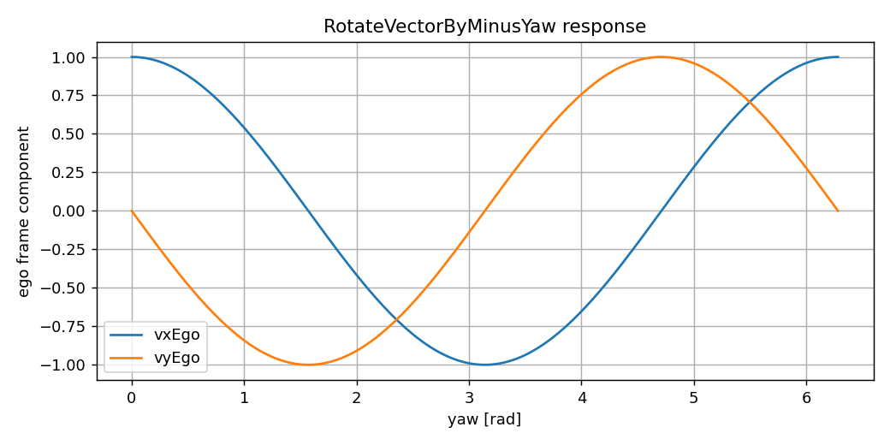 |
| ComputeBarrierSquared | 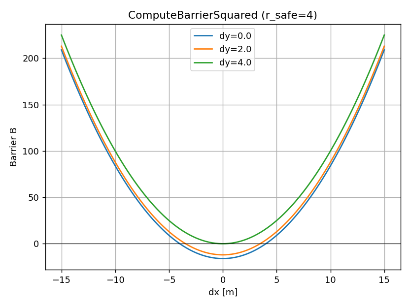 |
| ComputeBarrierFirstDerivative | 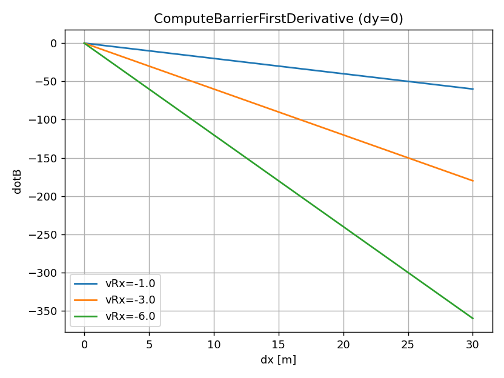 |
| ComputeBarrierSecondDerivativeFree | 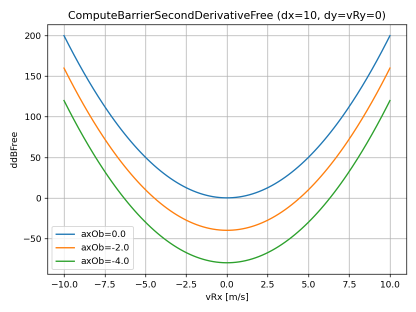 |
| ComputeObstacleAffineConstraint | 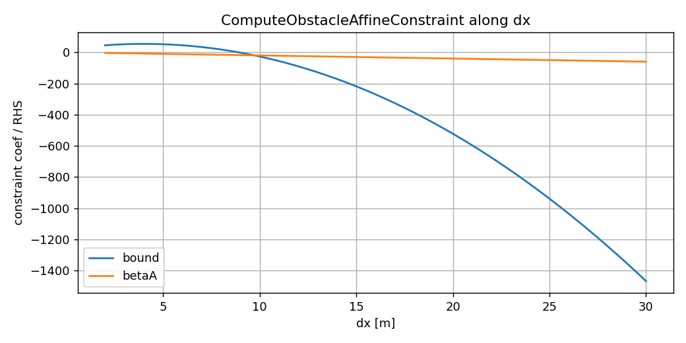 |
| ClampControlInput | 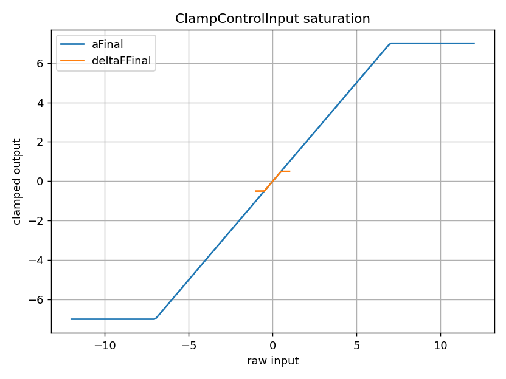 |
| SolveQpHildreth | 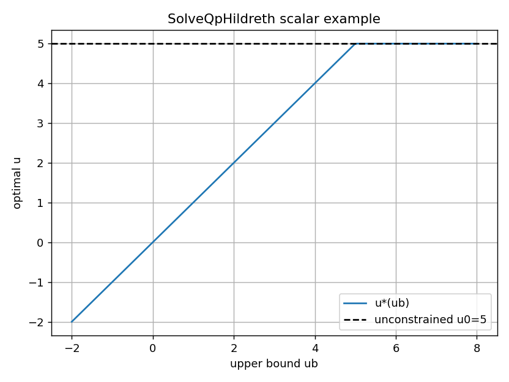 |
| CbfControlRevision | 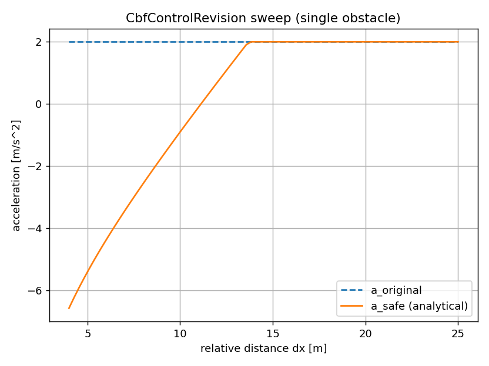 |

---

## 十二、参考文献

> **A Control Barrier Function-Based Driving Safety Control Revision Method for Autonomous Vehicles Plus Applicability Analysis**, IEEE Transactions on Industrial Electronics (TIE 260121).
> Section II — Preliminaries
> Section III-A — Constraints for Traffic Participants

PDF 原文位于 `ref/TIE 260121.pdf`。
