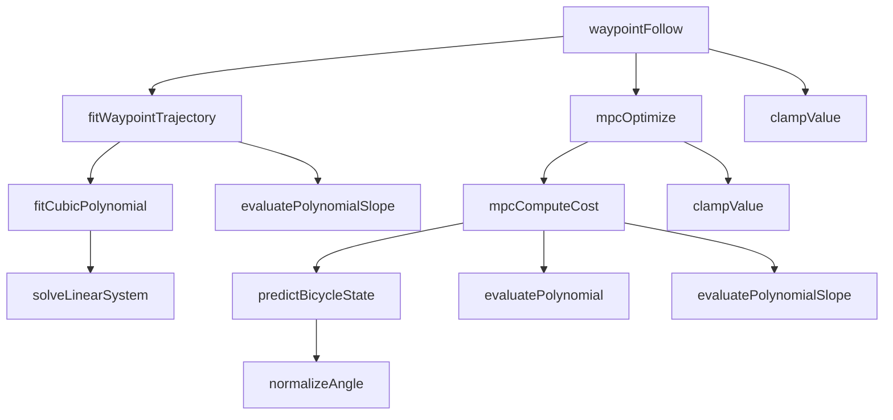
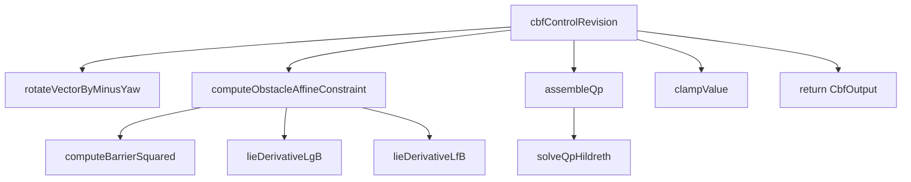
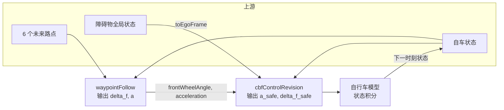

# GAASD 自动驾驶安全控制架构设计

本文档从工程架构视角说明 `waypointFollow` 与 `cbf` 两个模块的职责边界、数据流、接口契约以及集成仿真框架的设计 rationale。

---

## 1. 设计目标

本工程演示一条“端到端路点跟踪 + 安全控制修正”的自动驾驶纵向/横向控制链路：

- **waypointFollow**：将上游端到端模型给出的未来路点转化为可直接执行的目标方向盘转角、目标前轮转角与纵向加速度。
- **cbf**：在原始控制量基础上，根据 ego frame 下的障碍物状态求解 HOCBF-QP，输出满足安全约束的加速度与前轮转角修正量。
- **integration_sim**：搭建 `waypointFollow → cbf → 自行车模型` 的闭环仿真，验证多场景下的安全距离与舒适性。

核心设计原则：

- **算法与模型解耦**：每个模块同时提供面向过程的 C++ 实现（`cpp/`）和模型驱动的 MBD 实现（`mbd/`）。
- **无动态分配**：核心算法使用固定容量栈数组，便于嵌入式部署。
- **单一出口 / SSA 风格**：每个函数一个 `return`，优先使用 `const` 局部变量。
- **安全层独立**：CBF 作为独立的安全仲裁层，不修改 MPC 内部优化逻辑，只修正其输出。

---

## 2. 总体架构


```mermaid
graph LR
    subgraph 上游输入
        E2E[端到端模型<br/>6 个未来路点]
        PER[感知模块<br/>障碍物位置/速度]
        EGO[车辆状态<br/>速度/航向/当前转角]
    end

    subgraph 控制层
        WF[waypointFollow<br/>路点跟踪 MPC]
        CBF[cbf<br/>安全控制修正]
    end

    subgraph 下游输出
        ACT[执行器/仿真模型<br/>a_safe, delta_f_safe]
    end

    E2E -->|waypoints[6]| WF
    EGO -->|egoSpeed, currentSteeringWheelAngle| WF
    EGO -->|EgoState| CBF
    PER -->|ObstacleState[]| CBF
    WF -->|frontWheelAngle, acceleration| CBF
    CBF --> ACT
```

### 2.1 模块职责

| 模块 | 职责 | 输入 | 输出 |
|---|---|---|---|
| `waypointFollow` | 路点拟合 + MPC 优化 | 自车速度、当前方向盘转角、6 个未来路点 | `steeringWheelAngle`, `frontWheelAngle`, `acceleration` |
| `cbf` | 安全控制修正 | 自车状态、原始控制、障碍物 ego frame 状态 | `aSafe`, `deltaFSafe`, `feasible`, `activeNum`, `iterUsed` |
| `integration_sim` | 闭环仿真与可视化 | 场景配置 | CSV 轨迹、PNG 时域/空域图 |

### 2.2 关键设计决策

1. **waypointFollow 输出前轮转角而非仅方向盘转角**  
   CBF 内部使用自行车模型，其控制输入为前轮转角 `delta_f`。若仅输出方向盘转角，上层需要再次除以 `steeringRatio` 才能交给 CBF，易引入转换误差。因此在 `WaypointFollowOutput` 中显式增加 `frontWheelAngle` 字段。

2. **CBF 作为后处理安全层**  
   MPC 负责舒适性与跟踪性能，CBF 负责安全性。两者解耦后，可独立迭代、独立测试，也便于后续替换为其他安全滤波器（如 MPC-CBF、RL-CBF 等）。

3. **障碍物状态在 ego frame 表达**  
   CBF 的 HOCBF 约束基于相对距离与相对速度构建。将障碍物转换到 ego frame 后，安全约束形式更简洁，且与自车航向解耦。

---

## 3. 模块内部逻辑

### 3.1 waypointFollow 模块逻辑




**流程：**

1. `fitWaypointTrajectory` 将 6 个离散路点拟合为三次多项式参考轨迹。
2. `mpcOptimize` 以数值梯度下降优化未来 5 步的控制序列，目标是最小化横向/航向/控制增量代价。
3. `mpcComputeCost` 内部调用 `predictBicycleState` 前向预测状态。
4. 提取第一步控制量，经 `clampValue` 限幅后输出方向盘转角、前轮转角与加速度。

### 3.2 cbf 模块逻辑




**流程：**

1. 将障碍物全局加速度旋转到 ego frame。
2. 对每个障碍物生成二阶 HOCBF 仿射约束。
3. 叠加控制输入 box 约束，装配为 2D QP。
4. 使用 Hildreth 对偶坐标下降求解 QP。
5. 对解做终值饱和，输出安全控制。

---

## 4. 接口契约

### 4.1 waypointFollow 接口

**输入：** `WaypointFollowInput`

| 字段 | 类型 | 说明 |
|---|---|---|
| `egoSpeed` | double | 自车车速 (m/s) |
| `currentSteeringWheelAngle` | double | 当前方向盘转角 (rad) |
| `waypoints[6]` | `Waypoint` | 未来 0.5/1.0/1.5/2.0/2.5/3.0 s 的参考路点 |

**输出：** `WaypointFollowOutput`

| 字段 | 类型 | 说明 |
|---|---|---|
| `steeringWheelAngle` | double | 目标方向盘转角 (rad) |
| `frontWheelAngle` | double | 目标前轮转角 (rad) |
| `acceleration` | double | 目标纵向加速度 (m/s²) |

**坐标系：** 自车坐标系，x 向前为正，y 向左为正。

### 4.2 cbf 接口

**输入：**

| 结构体 | 字段 | 说明 |
|---|---|---|
| `EgoState` | `velocity`, `phi`, `aOriginal`, `deltaFOriginal` | 自车速度、航向、原始控制 |
| `ObstacleState` | `dxEgo`, `dyEgo`, `vRxEgo`, `vRyEgo`, `axGlobal`, `ayGlobal` | 障碍物 ego frame 相对位置/速度 + 全局加速度 |
| `CbfParam` | `safetyRadius`, `alpha1`, `alpha2`, `wheelBase`, `aMin`, `aMax`, `deltaFMin`, `deltaFMax`, `qDiagAccel`, `qDiagSteer` | CBF 算法参数 |

**输出：** `CbfOutput`

| 字段 | 类型 | 说明 |
|---|---|---|
| `aSafe` | double | 修正后安全加速度 (m/s²) |
| `deltaFSafe` | double | 修正后安全前轮转角 (rad) |
| `feasible` | bool | QP 是否找到可行解 |
| `activeNum` | size_t | 生效的 CBF 约束数 |
| `iterUsed` | size_t | QP 实际迭代步数 |

### 4.3 接口桥接要点

- `waypointFollow` 输出的 `frontWheelAngle` 直接作为 `cbf` 的 `deltaFOriginal`。
- `waypointFollow` 输出的 `acceleration` 直接作为 `cbf` 的 `aOriginal`。
- `cbf` 输出 `deltaFSafe` 给自行车模型积分时同样为前轮转角，无需再除以 `steeringRatio`。

---

## 5. 集成仿真数据流




**流程：**

1. 仿真器按场景生成 6 个未来路点与自车初始状态。
2. `waypointFollow` 输出目标前轮转角 `frontWheelAngle` 与纵向加速度 `acceleration`。
3. `cbf` 将障碍物全局状态通过 `toEgoFrame` 转换到 ego frame，求解 HOCBF-QP。
4. 安全控制量输入自行车模型进行状态积分，得到下一时刻 ego 状态并闭环迭代。

---

## 6. 坐标系与单位约定

### 6.1 自车坐标系（ego frame）

- 原点：自车 rear axle 中心。
- x 轴：沿自车纵轴向前为正。
- y 轴：沿自车横轴向左为正。
- 航向 `phi`：自车纵轴与全局 x 轴夹角，逆时针为正。

### 6.2 全局坐标系

- 标准右手坐标系，x 向前，y 向左。
- 障碍物位置、速度在全局坐标系下给出，由 `toEgoFrame()` 转换到 ego frame。

### 6.3 单位

| 物理量 | 单位 |
|---|---|
| 长度 | m |
| 速度 | m/s |
| 加速度 | m/s² |
| 角度 | rad |
| 角速度 | rad/s |
| 时间 | s |

---

## 7. CBF 安全层设计

### 7.1 控制障碍函数

对每个障碍物定义平方型障碍函数：

```
h(x) = (dx_ego)² + (dy_ego)² - (r_safety)²
```

其中 `dx_ego`、`dy_ego` 为障碍物在 ego frame 下的相对位置，`r_safety` 为安全半径。

通过二阶 HOCBF 约束保证：

```
L_f² h + L_g L_f h · u + α1 · (L_f h + α2 · h) ≥ 0
```

其中 `u = [a, delta_f]^T` 为控制输入。

### 7.2 QP 形式

最小化与原始控制的偏差：

```
min   q_a · (a - a_original)² + q_delta · (delta_f - delta_f_original)²
s.t.  HOCBF 约束（每个障碍物一个）
      a_min ≤ a ≤ a_max
      delta_f_min ≤ delta_f ≤ delta_f_max
```

通过调节 `qDiagAccel` 与 `qDiagSteer` 可权衡“优先减速”还是“优先转向”。

### 7.3 参数调优示例

| 场景 | `qDiagSteer` | 策略 |
|---|---|---|
| `lead_brake` | 200.0 | 强烈优先制动 |
| `cut_in` | 200.0 | 减速为主，允许轻微转向 |
| `cross_pedestrian` | 200.0 | 减速为主 |
| `swerve_obstacle` | 10.0 | 允许 CBF 使用转向绕行 |

---

## 8. 集成仿真场景设计

### 8.1 场景列表

| 场景 | 主要验证点 | 策略 |
|---|---|---|
| `lead_brake` | 前车急刹 | 纵向制动 |
| `cut_in` | 右侧车辆切入 | 减速 + 轻微转向 |
| `cross_pedestrian` | 行人横穿 | 减速为主 |
| `swerve_obstacle` | 车道内静止障碍物 | 转向规避 |

### 8.2 安全验证结果

| 场景 | 最小距离 | 最终速度 | 是否满足安全半径 5 m |
|---|---|---|---|
| `lead_brake` | 7.40 m | 4.06 m/s | ✅ |
| `cut_in` | 5.55 m | 11.81 m/s | ✅ |
| `cross_pedestrian` | 5.17 m | 0.45 m/s | ✅ |
| `swerve_obstacle` | 16.35 m | 14.60 m/s | ✅ |

### 8.3 典型轨迹

| 前车急刹 `lead_brake` | 切入 `cut_in` |
|---|---|
|  |  |

| 行人横穿 `cross_pedestrian` | 转向规避 `swerve_obstacle` |
|---|---|
|  |  |

---

## 9. 构建与复现

### 9.1 独立模块

```bash
cd waypointFollow
cmake -B build
cmake --build build
ctest --test-dir build --output-on-failure

cd ../cbf
cmake -B build
cmake --build build
ctest --test-dir build --output-on-failure
```

### 9.2 集成仿真

```bash
cd test/integration_sim
cmake -B build
cmake --build build
./build/integration_sim
python3 scripts/plot_scenarios.py
```

### 9.3 重新生成架构图

```bash
python3 scripts/draw_architecture.py
```

---

## 10. 扩展性与已知限制

### 10.1 扩展方向

- **多障碍物**：当前每个场景仅一个障碍物，CBF 已支持 `ObstacleState[]`，可直接扩展。
- **道路边界**：当前 CBF 未加入车道线/道路边界约束，横向修正可能使车辆偏离车道。
- **动态障碍物预测**：当前障碍物状态为当前帧测量值，可接入预测模块给出未来轨迹。
- **更复杂车辆模型**：当前使用单轨自行车模型，可替换为更精确的动力学模型。

### 10.2 已知限制

- **车道约束缺失**：当前 CBF 未加入车道线/道路边界约束，横向修正可能使车辆偏离车道，后续应补充道路边界约束或限制横向修正幅度。

### 10.3 已修复问题

- **MBD 库在 macOS 上的 include 路径冲突**：原 `CMakeLists.txt` 使用全局 `include_directories(include/cpp)`，导致 MBD 目标在搜索 `ClampValue.hpp` / `RotateVectorByMinusYaw.hpp` 等大写头文件时，因 `include/cpp` 排在 `include/mbd` 之前，且 macOS 默认大小写不敏感，误匹配到 `include/cpp` 下的小写同名头文件（如 `clampValue.hpp`）。已移除全局 include，改为按目标单独设置，并确保 MBD 目标的 `include/mbd` 始终优先于 `include/cpp`，C++ 目标仅使用 `include/cpp`。

---

## 11. 参考

- 根目录说明：`../README.md`
- CBF 模块详细文档：`../cbfArbitration/Readme.md`
- waypointFollow 模块详细文档：`../waypointFollow/Readme.md`
- 集成仿真说明：`../test/integration_sim/README.md`
