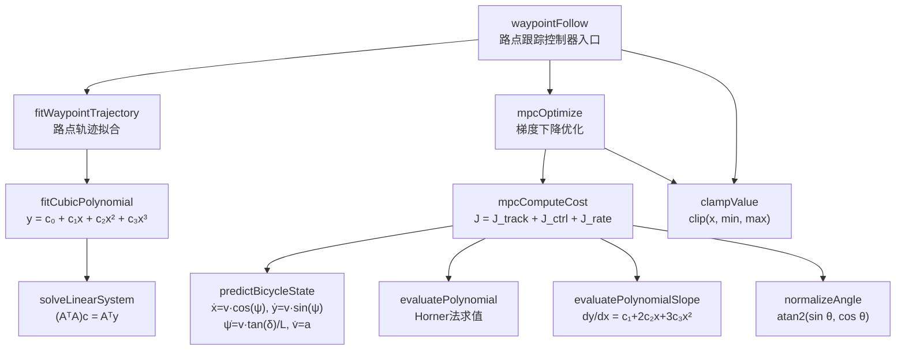
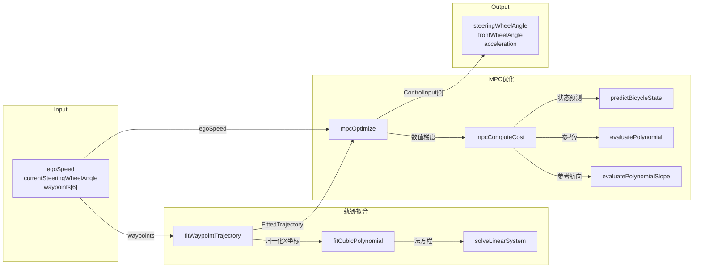

# 路点跟踪 MPC 控制器 (Waypoint Follow MPC Controller)

基于模型预测控制 (MPC) 的自动驾驶车辆路点跟踪控制器。输入自车车速、方向盘转角和 6 个参考路点（对应未来 0.5~3.0 秒），输出当前时刻的方向盘转角和加速度控制量，控制频率 10Hz。

**作者**: 许庆 (qingxu@tsinghua.edu.cn)
**AI 辅助**: 本项目使用 Cursor Agent (Claude Opus 4.6) 辅助开发

---

## 目录结构

```
waypointFollow/
├── include/cpp/                          # 头文件
│   ├── waypointFollowTypes/              # 共享类型定义
│   │   └── waypointFollowTypes.hpp
│   ├── solveLinearSystem/                # 线性方程组求解器
│   ├── fitCubicPolynomial/               # 三次多项式拟合
│   ├── evaluatePolynomial/               # 多项式求值
│   ├── evaluatePolynomialSlope/          # 多项式斜率求值
│   ├── predictBicycleState/              # 运动学自行车模型
│   ├── clampValue/                       # 数值限幅截断
│   ├── normalizeAngle/                   # 角度归一化
│   ├── fitWaypointTrajectory/            # 路点轨迹拟合组件
│   ├── mpcComputeCost/                   # MPC代价函数
│   ├── mpcOptimize/                      # MPC优化器
│   └── waypointFollow/                   # 顶层控制器入口
├── src/cpp/                              # 源文件 (目录结构与 include 一致)
├── tests/cppTest/                        # 测试
│   ├── unit/                             # 单元测试
│   │   ├── waypointFollow/               # 控制器集成测试
│   │   ├── fitCubicPolynomial/           # 多项式拟合测试
│   │   └── predictBicycleState/          # 自行车模型测试
│   ├── verify/                           # 代码规范验证报告
│   └── output/waypointFollow/            # 可视化输出
├── ref/                                  # 参考资料
├── doc/                                  # 设计文档
├── build/                                # 编译输出
├── prompt/                               # Prompt 模板文件
├── CMakeLists.txt                        # 构建配置
└── Readme.md                             # 本文件
```

---

## 函数层级关系树与公式映射



---

## 函数调用拓扑与数据流图



---

## 核心算法说明

### 1. 轨迹拟合
将 6 个参考路点的 X 坐标归一化到 [0, 1] 后，使用最小二乘法拟合三次多项式：

$$y(x_n) = c_0 + c_1 x_n + c_2 x_n^2 + c_3 x_n^3$$

其中 $x_n = (x - x_{min}) / (x_{max} - x_{min})$

### 2. 运动学自行车模型
预测模型采用前轮转角输入的运动学自行车模型：

$$\dot{x} = v \cos\psi, \quad \dot{y} = v \sin\psi, \quad \dot{\psi} = \frac{v \tan\delta}{L}, \quad \dot{v} = a$$

### 3. MPC 代价函数
代价函数由三部分组成：

$$J = \sum_{k=1}^{N_p} \left( w_{\text{lat}} e_y^2 + w_{\text{head}} e_\psi^2 + w_v e_v^2 \right) + \sum_{k=0}^{N_c-1} \left( w_\delta \delta_k^2 + w_a a_k^2 \right) + \sum_{k=0}^{N_c-1} \left( w_{\Delta\delta} \Delta\delta_k^2 + w_{\Delta a} \Delta a_k^2 \right)$$

### 4. 优化方法
使用前向有限差分计算数值梯度，固定步长梯度下降法迭代优化，每步施加幅值约束和变化率约束。

---

## 构建方法

```bash
# 配置
cmake -B build -DCMAKE_BUILD_TYPE=Release

# 编译
cmake --build build

# 运行测试
cd build && ctest --output-on-failure
```

---

## 使用说明

```cpp
#include "waypointFollow/waypointFollow.hpp"

using namespace waypoint_follow;

// 初始化参数和状态 (仅需一次)
WaypointFollowParam param;  // 使用默认参数
WaypointFollowState state;  // 跨周期持久化

// 每个控制周期 (10Hz) 调用
WaypointFollowInput input;
input.egoSpeed = 15.0;                    // m/s
input.currentSteeringWheelAngle = 0.05;   // rad
input.waypoints[0] = {7.5, 0.1};         // 未来 0.5s
input.waypoints[1] = {15.0, 0.4};        // 未来 1.0s
input.waypoints[2] = {22.5, 0.9};        // 未来 1.5s
input.waypoints[3] = {30.0, 1.6};        // 未来 2.0s
input.waypoints[4] = {37.5, 2.5};        // 未来 2.5s
input.waypoints[5] = {45.0, 3.6};        // 未来 3.0s

const WaypointFollowOutput output = waypointFollow(input, param, state);
// output.steeringWheelAngle: 目标方向盘转角 (rad)
// output.frontWheelAngle:    目标前轮转角 (rad)，等于方向盘转角 / 传动比
// output.acceleration:       目标加速度 (m/s^2)
```

---

## MPC 参数说明

| 参数 | 默认值 | 说明 |
|------|--------|------|
| predictionHorizon | 15 | 预测步数 (1.5s) |
| controlHorizon | 5 | 控制步数 (0.5s) |
| dt | 0.1 | 预测步长 (s) |
| wheelbase | 2.85 | 前后轴距 (m) |
| maxSteeringAngle | 0.5236 | 前轮最大转向角 (~30°) |
| steeringRatio | 15.0 | 方向盘传动比 |
| wLateral | 50.0 | 横向偏差权重 |
| wHeading | 30.0 | 航向偏差权重 |
| wSteeringRate | 100.0 | 转向平滑性权重 |
